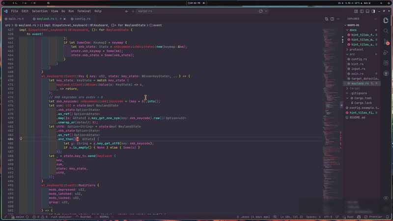
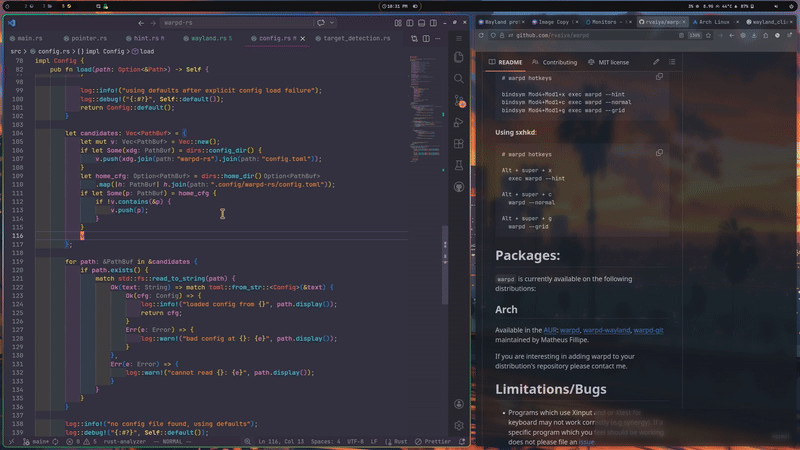
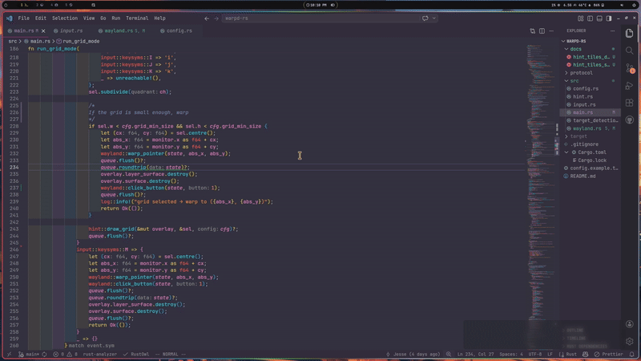
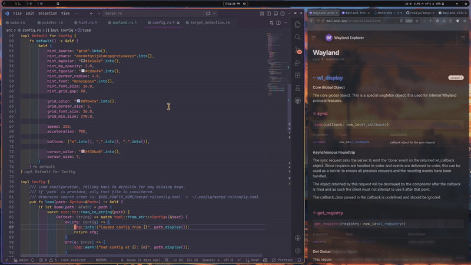

# warpd-rs

A modal keyboard-driven virtual pointer for **Wayland**, rewritten in Rust.

Inspired by [warpd](https://github.com/rvaiya/warpd) — this is a
Wayland-first implementation that targets wlroots-based compositors
(Sway, Hyprland, etc.).

## Modes

### Hint (`--hint`)

1. A grid of labelled boxes appears over the screen per the hint_source value
2. Type characters to filter — matching prefix is dimmed, remaining chars highlighted
3. When one hint remains the cursor warps to its centre, optionally finishes by activating LMB   
4. Press **Escape** to cancel, **Backspace** to undo a character

Hint targets are selected by `hint_source`:

- `static` (default): fixed interval x,y placement across the monitor
- `detect`: run OpenCV-based target detection on a screencopy frame    building


### Static (`hint_source=static` in config)
   

### Detect (`hint_source=detect` in config)
   

### Grid (`--grid`)
   

1. The screen is divided into four quadrants with a crosshair
2. Press **u** (top-left), **i** (top-right), **j** (bottom-left), **k** (bottom-right) to subdivide
3. Repeat until precise — the cursor warps when the cell is small enough
4. Press **m** to left-click at the current centre, **Escape** to cancel

### Normal (`--normal`)

   

1. A crosshair with a cursor dot appears at last known pointer position (or center of focused output if acquisition fails) 
2. Hold **h/j/k/l** for continuous movement
3. Press **m** for left-click, **,** for middle-click, **.** for right-click
4. Press **x** to switch to hint mode, **g** to switch to grid mode
5. Press **Escape** to cancel

## Configuration

Place a TOML file at `~/.config/warpd-rs/config.toml` [an example is included](./config.example.toml)

#### Hyprland binds

```ini
bind = SUPER ALT, x, exec, warpd-rs --hint
bind = SUPER ALT, g, exec, warpd-rs --grid
bind = SUPER ALT, c, exec, warpd-rs --normal
```

## Build


```bash
cargo build --release
```

If you don't want detect mode, build without opencv dep. 

```bash
cargo build --release --no-default-features
```

## Debug

Regular 🦀 convention applies for log level (`RUST_LOG=debug`)  

For troubleshooting compositor/wayland issues set `WAYLAND_DEBUG` envar 
Example output: 

```bash
% WAYLAND_DEBUG=1 ./target/release/warpd-rs --hint` 
# compositor registry 
[3594939.321][rs] -> wl_display@1.get_registry(wl_registry@2)
[3594939.352][rs] -> wl_display@1.sync(wl_callback@3)
[3594939.437][rs] <- wl_registry@2.global, (1, Some("wl_seat"), 9)
[3594939.506][rs] <- wl_registry@2.global, (2, Some("wl_data_device_manager"), 3)
...
# binding to required unstable protocols 
[3594944.441][rs] -> wl_registry@2.bind(35, Some("zwlr_layer_shell_v1"), 5, zwlr_layer_shell_v1@6)
[3594944.524][rs] -> wl_registry@2.bind(56, Some("zwlr_screencopy_manager_v1"), 3, zwlr_screencopy_manager_v1@7)
[3594944.597][rs] -> wl_registry@2.bind(30, Some("zwlr_virtual_pointer_manager_v1"), 2, zwlr_virtual_pointer_manager_v1@8)
[3594944.677][rs] -> wl_registry@2.bind(9, Some("zxdg_output_manager_v1"), 3, zxdg_output_manager_v1@9)
...
# outputs
[3594945.195][rs] <- wl_output@10.name, (Some("DP-1"))
[3594945.227][rs] <- wl_output@10.description, (Some("ASUSTek COMPUTER INC VG27A LBLMQS261708 (DP-1)"))
[3594945.315][rs] <- wl_output@10.scale, (1)
[3594945.336][rs] <- wl_output@10.mode, (1, 2560, 1440, 119998)
[3594945.367][rs] <- wl_output@10.geometry, (0, 0, 600, 340, 0, Some("ASUSTek COMPUTER INC"), Some("VG27A"), 0)
[3594945.450][rs] <- wl_output@10.done, ()
[3594945.470][rs] <- wl_output@11.name, (Some("HDMI-A-2"))
[3594945.516][rs] <- wl_output@11.description, (Some("LG Electronics LG ULTRAWIDE 0x00001B18 (HDMI-A-2)"))
[3594945.617][rs] <- wl_output@11.scale, (1)
[3594945.639][rs] <- wl_output@11.mode, (1, 2560, 1080, 60000)
[3594945.668][rs] <- wl_output@11.geometry, (0, 0, 800, 340, 0, Some("LG Electronics"), Some("LG ULTRAWIDE"), 0)
...
# surface probes to "find" the pointer/cursor
[3594950.368][rs] -> wl_compositor@3.create_surface(wl_surface@22)
[3594950.406][rs] -> zwlr_layer_shell_v1@6.get_layer_surface(zwlr_layer_surface_v1@23, wl_surface@22, wl_output@11, 3, Some("warpd-rs"))
[3594950.490][rs] -> zwlr_layer_surface_v1@23.set_anchor(15)
[3594950.523][rs] -> zwlr_layer_surface_v1@23.set_exclusive_zone(-1)
[3594950.553][rs] -> zwlr_layer_surface_v1@23.set_keyboard_interactivity(1)
[3594950.591][rs] -> zwlr_layer_surface_v1@23.set_size(2560, 1080)
[3594950.628][rs] -> wl_surface@22.commit() 
...
# jump the pointer to coords of user selected hint i.e. 'bv'
[3596258.338][rs] -> zwlr_virtual_pointer_v1@16.motion_absolute(884064554, 600, 200, 2560, 2520)
[3596258.369][rs] -> zwlr_virtual_pointer_v1@16.frame()
[3596258.392][rs] -> wl_display@1.sync(wl_callback@17)
...
# after jumping, press and release the pointer left button (click)
[3596258.508][rs] -> zwlr_layer_surface_v1@23.destroy()
[3596258.527][rs] -> wl_surface@22.destroy()
[3596258.546][rs] -> zwlr_virtual_pointer_v1@16.button(884064554, 272, 1)
[3596258.571][rs] -> zwlr_virtual_pointer_v1@16.frame()
[3596258.590][rs] -> zwlr_virtual_pointer_v1@16.button(884064555, 272, 0)
[3596258.615][rs] -> zwlr_virtual_pointer_v1@16.frame()
```

### Troubleshooting hint detection

If hints are missing in detect mode the intermediate processing pipeline can be inspected with:   

`WARPDRS_DETECT_DEBUG=1`
`WARPDRS_DETECT_DEBUG_DIR=/tmp/warpd-dbg`

The final stage represents pruned candidates (hints) in red, and forwarded (shown) candidates in green. 


See `$WARPDRS_DETECT_DEBUG_DIR/stats.txt` 

```txt
frame: 2560x1080 stride=10240 format=Argb8888 y_invert=false
monitor: name=HDMI-A-2 pos=(1920, -1080) size=2560x1080 transform=Normal
pipeline: scale=1.0000 kernel=4x3
rects: total=1754 kept_primary=706 kept_size_only=739 kept_final=706 used_fallback=false
files:
- /tmp/warpd-dbg/01_gray.png
- /tmp/warpd-dbg/02_transformed.png
- /tmp/warpd-dbg/03_edges.png
- /tmp/warpd-dbg/04_dilated.png
- /tmp/warpd-dbg/05_rects_overlay.png
```

## License

MIT
